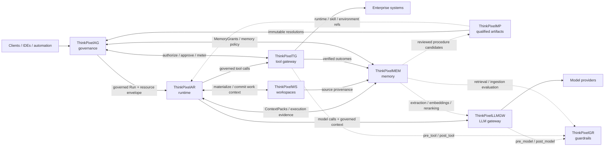

# ThinkPixelTG

ThinkPixelTG is the enterprise tool gateway and tool-execution enforcement plane
for the ThinkPixel platform. It mediates governed tool invocations so that
authorization, action-scoped approvals, downstream credentials, guardrails,
idempotency, metering, and audit evidence remain outside the model and harness.

> **The harness may decide what it wants to do. ThinkPixelTG decides whether and
> how that operation is allowed to reach the downstream system.**

ThinkPixelTG is harness- and provider-neutral. It integrates with policy,
guardrail, credential, connector, and evidence systems through explicit
contracts and adapters.

## Status

**Phases 0–3 are complete.** See [TODO.md](TODO.md) for the current delivery
ledger and [phase evidence](docs/README.md) for the gates that were actually
verified. Interfaces for later phases remain target contracts until their
implementation and tests land.

## Quick start

Requirements and pinned tooling are documented in
[development dependencies](docs/development/dependencies.md).

```sh
make build
make test
```

Start the local PostgreSQL environment with `make compose-up`; optional local
services and ports are described in the
[Compose guide](deployments/compose/README.md). Run the repository's aggregate
local/CI gate with:

```sh
make verify
```

Some verification targets require Docker or configured external test services.

## Key concepts

- ThinkPixelTG is the Policy Enforcement Point for governed tool calls;
  ThinkPixelAG, or a contract-compatible authorizer, is the Policy Decision
  Point.
- Caller content and identifiers request an operation but do not create tenant,
  subject, agent, Run, approval, connector, or credential authority.
- Tool versions are immutable, schema-validated capabilities. They are not
  arbitrary HTTP requests.
- Downstream credentials are resolved only after mandatory controls pass and
  never cross the harness boundary.
- ThinkPixelGR evaluations can block or transform bounded tool content but cannot
  override an authorization denial.
- PostgreSQL is authoritative for gateway state. Caches and external evidence
  sinks are not.
- MCP is a harness-facing compatibility adapter, not the internal authorization
  model.

The repository-local component boundary and family integration rules are in
[ALIGNMENT.md](ALIGNMENT.md). Detailed ownership and trust boundaries are in the
[system context](docs/architecture/system-context.md) and
[glossary](docs/architecture/glossary-and-ownership.md).

## Documentation

- [Documentation index](docs/README.md)
- [Implementation plan](PLAN.md) and [delivery ledger](TODO.md)
- [Architecture decisions](docs/adr/README.md)
- [Architecture](docs/architecture/README.md) and
  [security](docs/security/README.md)
- [Human-readable contracts](docs/contracts/README.md) and
  [OpenAPI contract](api/openapi.yaml)
- [Operations](docs/operations/README.md) and
  [supported versions](docs/supported-versions.md)

## ThinkPixel platform

This project is part of the **ThinkPixel** family: a modular, vendor-neutral set of components for building governed enterprise AI-agent platforms.

Each component is independently useful. The complete platform is a composition of replaceable services connected through versioned contracts; no component requires the full stack in order to be deployed.

| Component | Role |
|---|---|
| [ThinkPixelAG](https://github.com/bdobrica/ThinkPixelAG) | Agent governance and lifecycle control plane: agent/run authority, policy decisions, resource envelopes, approvals, revocation, and trusted governance state. |
| [ThinkPixelAR](https://github.com/bdobrica/ThinkPixelAR) | Agent runtime: durable Sessions, isolated/disposable execution, harness adaptation, recovery, and runtime events. |
| [ThinkPixelWS](https://github.com/bdobrica/ThinkPixelWS) | Durable roaming Workspaces: persistent work context, immutable generations, materializations, snapshots, forks, and source provenance. |
| [ThinkPixelMEM](https://github.com/bdobrica/ThinkPixelMEM) | Long-term agent memory: governed learned context, provenance, temporal revisions, retrieval, correction, and forgetting. |
| [ThinkPixelMP](https://github.com/bdobrica/ThinkPixelMP) | Marketplace and software supply-chain plane for Skills, runtimes, MCP servers, agent bundles, and other immutable agentic artifacts. |
| [ThinkPixelTG](https://github.com/bdobrica/ThinkPixelTG) | Tool gateway and policy-enforcement point for governed tool calls, downstream credentials, side effects, idempotency, and tool evidence. |
| [ThinkPixelLLMGW](https://github.com/bdobrica/ThinkPixelLLMGW) | LLM gateway for provider abstraction, model routing, credentials, budgets, accounting, and model-access policy enforcement. |
| [ThinkPixelGR](https://github.com/bdobrica/ThinkPixelGR) | Guardrails evaluator for model, tool, retrieval, and ingestion content. It returns findings/decisions; the calling gateway or service enforces them. |

### Intended composition



The diagram describes the **target integration model**, not a claim that every edge is implemented in every current release.

### Integration rules

The platform follows a few cross-component rules:

- **Authority does not emerge from content.** Marketplace metadata, Skills, Workspace membership, retrieved memory, model output, or a guardrail `allow` decision cannot grant permissions that the governed Run does not already have.
- **State has one authoritative owner.** Components exchange references and versioned messages; they do not read or write another component's database directly.
- **Integrations are adapters, not domain dependencies.** A ThinkPixel integration should be configurable and replaceable with a contract-compatible alternative.
- **Cross-component identity is explicit.** Where relevant, requests should carry stable governed context such as tenant, principal, agent, Run, Session/Workspace references, immutable artifact digests, and trace context.
- **Public integration contracts are versioned.** OpenAPI/JSON Schema/protobuf or another explicit wire contract is preferred over importing another repository's internal types.
- **Vendor-specific behavior stays behind adapters.** Model providers, agent harnesses, storage systems, registries, policy engines, and execution substrates must not become platform-wide domain contracts.

### Planned integration points

| Integration | Intended contract |
|---|---|
| **AG → AR** | AG admits a Run and supplies its authority/resource context; AR executes it and must not enlarge that authority. Revocation, lease, and fencing state flow back into runtime enforcement. |
| **MP → AG / AR / WS** | MP resolves qualified artifacts to immutable identities/digests. AG decides whether they may be used; AR/WS consume the resolved runtime, Skill, or environment references. Qualification is not authorization. |
| **AR ↔ WS** | AR materializes a durable Workspace generation into disposable execution and returns committed/checkpointed work to WS. Session identity remains owned by AR; Workspace identity remains owned by WS. |
| **AR → LLMGW** | Agent model calls go through LLMGW with governed Run/tenant context. Provider credentials and provider-specific routing stay outside the harness. |
| **LLMGW ↔ GR** | LLMGW will support an optional configured GR endpoint/profile mapping. It invokes `pre_model` before provider dispatch and `post_model` before releasing model output, then enforces GR's decision/transformation. GR remains optional and replaceable; its wire API is the contract. |
| **AR → TG** | Harness tool calls cross TG rather than reaching governed enterprise systems directly. TG owns credential brokerage, idempotency/side-effect handling, and trusted tool evidence. |
| **TG ↔ AG** | TG asks AG (or a contract-compatible authorizer) whether the current governed Run may perform the exact operation and obtains action-scoped approval when required. TG returns trusted metering/evidence. |
| **TG ↔ GR** | TG invokes `pre_tool` and `post_tool` evaluation when configured and enforces the result. A GR allow never overrides an AG authorization denial. |
| **AR / WS / TG → MEM** | Execution history, Workspace provenance, and verified tool outcomes may become evidence for learned memory. MEM does not become the source of truth for those upstream systems. |
| **AG ↔ MEM** | AG supplies Run-scoped memory authority (for example MemoryGrants); MEM enforces it for reads/writes and returns structured ContextPacks. |
| **MEM ↔ LLMGW / GR** | MEM may use LLMGW for extraction/embedding/reranking and GR for ingestion/retrieval inspection while keeping canonical memory state independent from either service. |
| **MEM → MP** | Learned procedure candidates may be reviewed and promoted through MP into qualified reusable Skills; learning does not silently become trusted executable behavior. |

Project-specific implementation status, supported versions, and release qualification belong in each project's own documentation.

## License

Licensed under the terms in [LICENSE](LICENSE).
