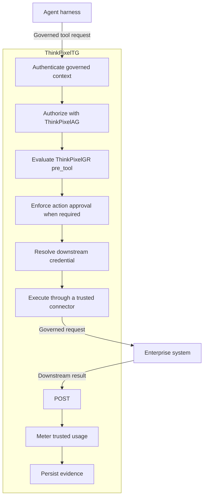
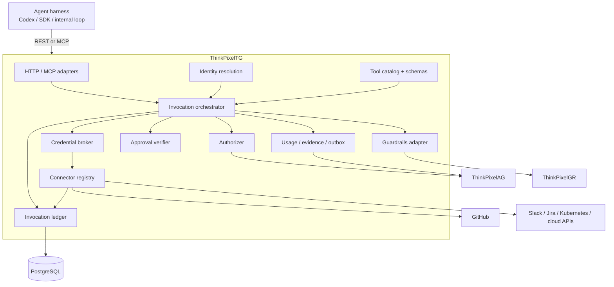
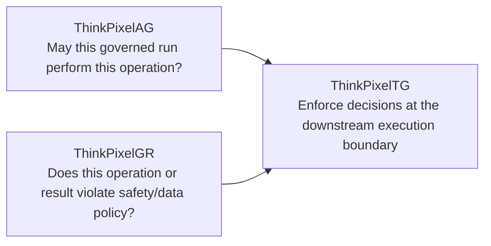
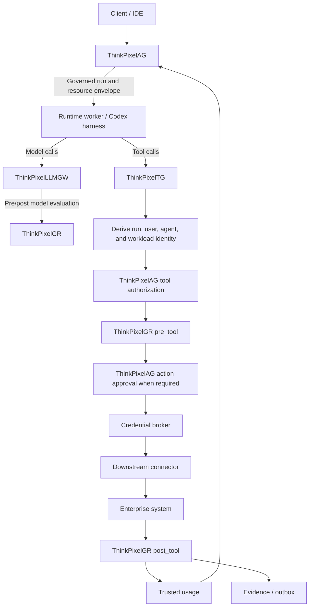
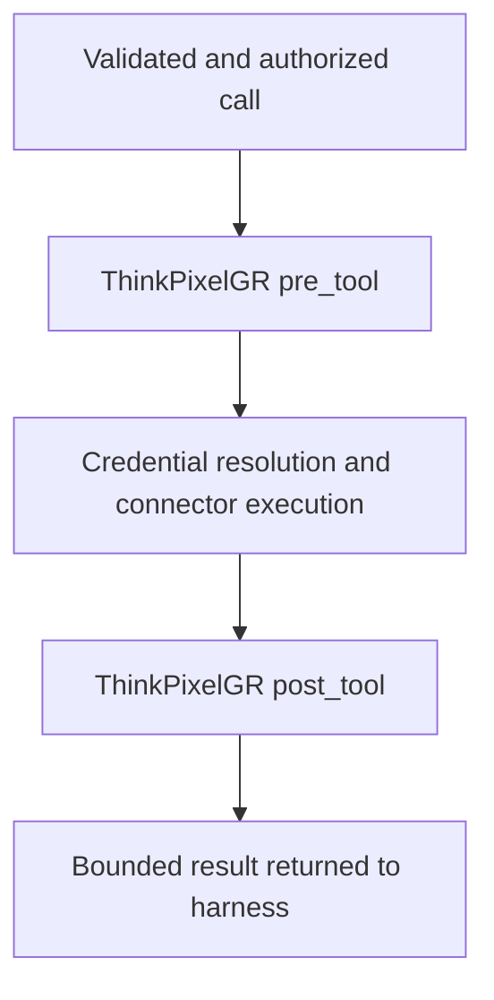
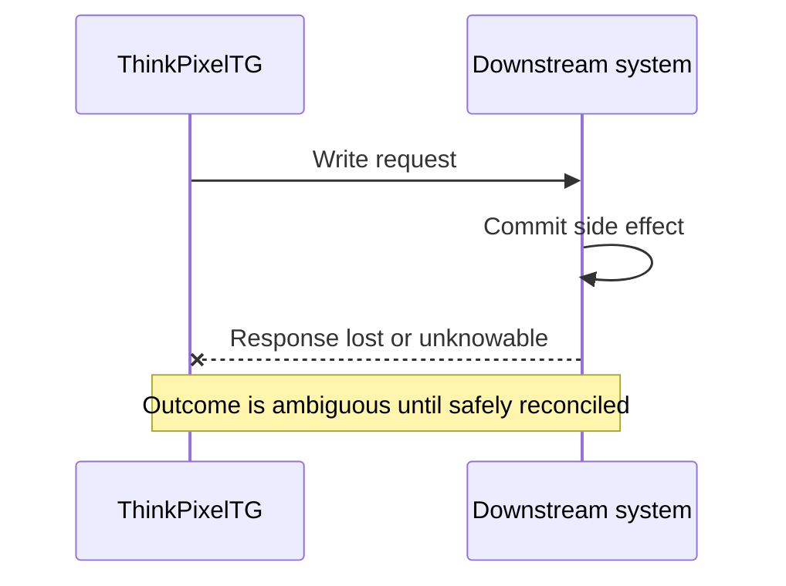
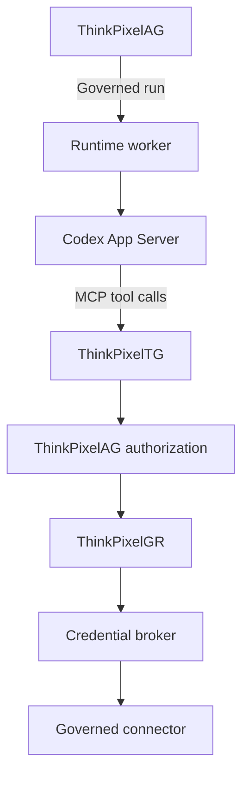
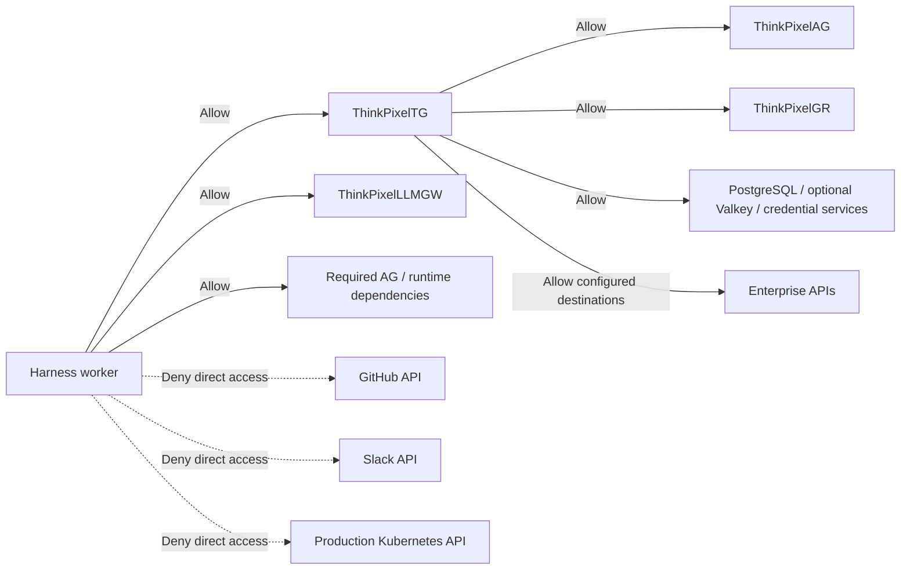
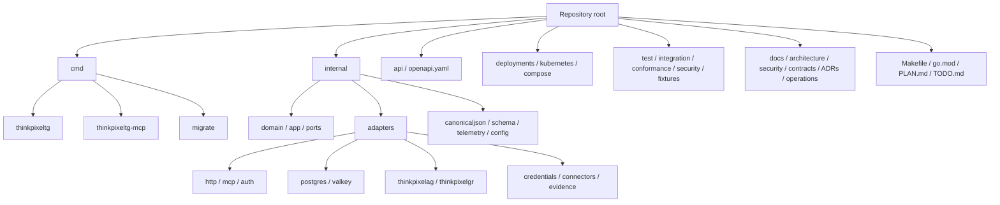
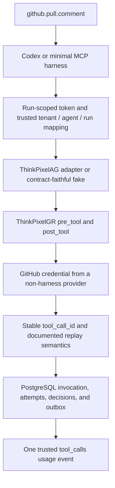

# ThinkPixelTG

ThinkPixelTG is the enterprise tool gateway and tool-execution enforcement plane for the ThinkPixel platform. It sits between agent harnesses and enterprise systems and mediates governed tool invocations so that authorization, action-scoped approvals, downstream credentials, guardrails, idempotency, metering, and audit evidence remain outside the model and harness.

The central invariant is:

> **The harness may decide what it wants to do. ThinkPixelTG decides whether and how that operation is allowed to reach the downstream system.**

ThinkPixelTG is designed to work with [ThinkPixelAG](https://github.com/bdobrica/ThinkPixelAG), [ThinkPixelGR](https://github.com/bdobrica/ThinkPixelGR), and [ThinkPixelLLMGW](https://github.com/bdobrica/ThinkPixelLLMGW), while remaining independent of any particular agent harness or model provider.

It implements the tool-enforcement boundary described in [A Minimum Viable Platform for Enterprise AI Agents](https://medium.com/@bdobrica/a-minimum-viable-platform-for-enterprise-ai-agents-e73d69d61527).

## Status

**Phases 0–2 complete; Phase 3 identity and authorization enforcement is next.**

[PLAN.md](PLAN.md) is the implementation contract for the first release candidate. It defines the security model, domain model, APIs, connector framework, MCP compatibility layer, delivery phases, test strategy, and release gates.

The project documentation is now organized as follows:

- [PLAN.md](PLAN.md) defines the target architecture and invariants;
- [TODO.md](TODO.md) is the ordered implementation ledger;
- [Phase 0 evidence](docs/phase-0-evidence.md) records completed governance gates;
- [Phase 1 evidence](docs/phase-1-evidence.md) records the engineering-foundation gates;
- [Phase 2 evidence](docs/phase-2-evidence.md) records the authoritative-persistence gates;
- [architecture documentation](docs/architecture/README.md), [security documentation](docs/security/README.md), and [contracts](docs/contracts/README.md) define the current normative baseline;
- [architecture decision records](docs/adr/README.md) capture consequential decisions;
- [OpenAPI](api/openapi.yaml) describes the canonical REST contract;
- [supported versions](docs/supported-versions.md) pins MCP and security protocol baselines.

Interfaces described below are target contracts until their implementation and tests land in the repository.

## Goals

- Provide a stable, harness-independent tool execution API.
- Make enterprise tools canonical, versioned, schema-validated capabilities rather than arbitrary HTTP requests.
- Preserve subject, agent, run, and workload identity across every protected invocation.
- Enforce ThinkPixelAG authorization at the actual side-effect boundary.
- Bind high-risk approvals to an exact operation and normalized argument digest.
- Apply ThinkPixelGR `pre_tool` and `post_tool` evaluations without confusing guardrails with authorization.
- Broker downstream credentials without exposing them to the model or harness.
- Make logical tool calls idempotent where possible and explicitly classify when they are not.
- Treat ambiguous downstream outcomes as a first-class distributed-systems state.
- Emit trusted tool-usage events to ThinkPixelAG.
- Produce reconstructable evidence for authorization, execution, retries, and results.
- Expose MCP as a compatibility adapter without making MCP the internal security model.
- Run as a lightweight, hardened Go service suitable for Kubernetes.

## Non-goals for the first release candidate

- Registering or approving agents.
- Admitting, scheduling, or orchestrating complete agent runs.
- Replacing ThinkPixelAG as the authoritative agent/run policy decision point.
- Routing LLM traffic or owning model credentials.
- Replacing ThinkPixelGR as the content/risk evaluator.
- Acting as a general-purpose secret manager.
- Providing reusable enterprise credentials to the harness.
- Providing a generic caller-controlled HTTP proxy.
- Executing arbitrary shell commands inside an agent workspace.
- Acting as an arbitrary third-party MCP proxy or MCP marketplace.
- Loading arbitrary executable connector plugins from writable disk.
- Implementing a general-purpose workflow engine.

## Why a tool gateway?

Agent harnesses such as Codex, SDK-based agents, or internal agent loops are useful execution engines, but they should not become the enterprise authorization or credential boundary.

A harness may be compromised, manipulated by prompt injection, misled by retrieved content, or simply make the wrong decision. Giving the harness reusable GitHub, Slack, Jira, cloud, or Kubernetes credentials makes the harness part of the security perimeter.

ThinkPixelTG moves that authority out of the harness:



The harness never needs the downstream credential.

## Architecture

The first release is planned as a modular Go service with PostgreSQL as authoritative state, optional Valkey for bounded acceleration, compiled connector implementations, a canonical REST API, and MCP adapters for compatible harnesses.



ThinkPixelTG is a **Policy Enforcement Point (PEP)**. ThinkPixelAG is expected to act as the primary **Policy Decision Point (PDP)** for governed runs.

The boundary is deliberate:



A GR `allow` never overrides an authorization denial.

## ThinkPixel platform integration

The intended complete path is:



Codex is one possible harness, not part of ThinkPixelTG's security model. Replacing Codex with another harness should not change authorization, approval, credential, retry, or evidence semantics.

Likewise, MCP is a harness-facing protocol adapter rather than the gateway's internal domain protocol.

## Security and reliability principles

### The harness is not a security boundary

Assume model output, prompts, retrieved documents, tool output, MCP clients, and the harness itself may contain malicious or misleading instructions.

A syntactically valid model-generated tool call is therefore only a **request to attempt an operation**. It is not authorization.

### Preserve distinct identities

Every protected invocation preserves at least:

```text
subject principal   employee or initiating service
agent identity      governed agent + immutable version
run identity        governed logical run
workload identity   process/pod actually calling ThinkPixelTG
```

Fields such as `tenant_id`, `run_id`, `agent_id`, or `principal_id` in an ordinary request body never establish authority by themselves.

### Credentials do not cross the harness boundary

The model and harness must never receive downstream secrets such as:

- GitHub PATs;
- Slack tokens;
- OAuth refresh tokens;
- cloud provider access keys;
- Kubernetes bearer tokens;
- client secrets;
- private keys;
- plaintext secret-manager values.

ThinkPixelTG stores credential **references and bindings**, not reusable plaintext enterprise credentials.

Credential material is resolved only after authentication, argument validation, authorization, approval, and mandatory pre-tool controls have passed.

### No OAuth token passthrough

A bearer token presented to ThinkPixelTG authenticates the caller **to ThinkPixelTG**. It must not simply be forwarded to GitHub, Slack, Kubernetes, or another downstream API.

Downstream authority is obtained independently through the configured credential binding or token-exchange mechanism.

### Deny by default

Protected operations fail closed when ThinkPixelTG cannot establish a mandatory prerequisite, including:

- authenticated governed context;
- current authorization when freshness is required;
- valid immutable tool version;
- valid normalized arguments;
- required approval with a matching digest;
- required ThinkPixelGR evaluation;
- credential binding;
- defined retry semantics;
- safe resolution of an ambiguous previous attempt.

Dependency failure must not become an authorization bypass.

## Canonical tools

A ThinkPixelTG tool is a stable logical capability with immutable published versions.

Example:

```text
github.pull.comment@3
```

A trusted definition may include:

```yaml
id: github.pull.comment
version: 3
title: Comment on pull request
description: Add a comment to an existing GitHub pull request.

connector:
  type: github
  operation: pull.comment

input_schema: {...}
output_schema: {...}

side_effect: write
risk_class: medium
retry_semantics: downstream_idempotency
approval_class: policy
open_world: true

credential_binding_selector: github-user-delegated

resource_projection:
  repository: $.repository
  pull_request: $.pull_request

metering:
  dimension: tool_calls
  units: "1"

limits:
  request_bytes: 65536
  response_bytes: 1048576
  timeout: 20s
```

Security-relevant metadata is authoritative in ThinkPixelTG.

MCP annotations may be **derived** from that metadata for compatibility, but MCP annotations are never accepted as authorization or risk-policy inputs.

Changing connector semantics, schemas, resource projection, side-effect class, retry behavior, credential selection, or other security-relevant behavior requires a new tool version.

## Invocation model

Every logical operation has a stable `tool_call_id`.

For governed runs:

```text
(tenant_id, run_id, tool_call_id)
```

identifies one logical action.

Retries of the same logical action reuse the same ID.

If the same logical ID arrives with the same immutable tool version and canonical argument digest, ThinkPixelTG returns or resumes the established operation.

If it arrives with different arguments or a different tool version, the request is rejected rather than reinterpreted as a second operation.

### Target REST API

The canonical API is planned around OpenAPI 3.1.

Discovery:

```http
GET /v1/tools
GET /v1/tools/{tool_id}
```

Invocation:

```http
POST /v1/tool-calls
GET  /v1/tool-calls/{tool_call_id}
```

Example:

```json
{
  "tool_call_id": "019c...",
  "tool": "github.pull.comment",
  "version": 3,
  "arguments": {
    "repository": "payments",
    "pull_request": 842,
    "text": "Looks good after the retry fix."
  }
}
```

The request body does **not** establish tenant, user, agent, or run identity. Those come from authenticated context and trusted resolution.

A completed response may look like:

```json
{
  "tool_call_id": "019c...",
  "invocation_id": "019c...",
  "state": "succeeded",
  "tool": "github.pull.comment",
  "version": 3,
  "result": {
    "structured": {
      "comment_id": 123456
    }
  }
}
```

A high-risk operation may instead enter:

```json
{
  "tool_call_id": "019c...",
  "invocation_id": "019c...",
  "state": "waiting_for_approval",
  "approval": {
    "approval_request_id": "019c...",
    "expires_at": "..."
  }
}
```

The authoritative status/error contract belongs in OpenAPI.

## Action-scoped approvals

ThinkPixelTG does not treat "this agent is approved" as permission for every operation it may later generate.

Approvals are expected to bind to an exact governed action, including:

```text
run
tool + immutable version
normalized arguments digest
target resource projection
approval policy/version
expiry
```

Conceptually:

```text
approve(
    run=run-123,
    tool=kubernetes.deployment.restart@2,
    resource=prod/payments/api,
    args_digest=sha256(...)
)
```

If security-relevant arguments change, the approval no longer matches.

## ThinkPixelGR integration

ThinkPixelGR is integrated at the tool boundary:



A `pre_tool` transformation that changes security-relevant arguments must trigger the required canonicalization and authorization/approval revalidation before execution.

A `post_tool` decision may block, redact, or transform downstream output before it returns to the model.

Downstream credentials are never sent to GR.

## Credential broker

Credential selection is controlled by trusted tool and connector configuration, never arbitrary harness arguments.

Planned providers include:

- Kubernetes projected credentials and workload identity;
- HashiCorp Vault;
- AWS STS / Secrets Manager;
- Google workload federation / Secret Manager;
- Azure managed identity / Key Vault;
- OAuth token exchange/token endpoint flows;
- a development-only environment provider.

Short-lived authority is preferred.

## Connector framework

Initial connectors are compiled Go implementations behind a narrow interface.

Representative shape:

```go
type Connector interface {
    Execute(ctx context.Context, req ConnectorRequest) (ConnectorResult, error)
}
```

Connectors receive normalized arguments, trusted resource projection, logical tool-call identity, bounded deadlines, retry context, and an already-resolved credential capability.

The first release candidate deliberately avoids arbitrary executable plugins.

### No arbitrary URL connector

A generic model-controlled URL is an SSRF primitive.

The first release candidate therefore does not include a generic caller-controlled HTTP proxy. HTTP-backed connectors use administrator-controlled hosts, schemes, credential headers, redirect behavior, payload bounds, and immutable tool definitions.

## Side effects, retries, and ambiguity

Retries are part of the tool contract.

Each tool version declares one trusted retry class:

| Retry class | Meaning |
|---|---|
| `safe` | Operation is contractually safe to repeat. |
| `downstream_idempotency` | Downstream accepts a reliable idempotency key. |
| `gateway_deduplicated` | TG can prove completion before replay under the documented contract. |
| `reconcile_before_retry` | TG must query downstream state before deciding whether replay is safe. |
| `at_least_once_accepted` | Duplicates are explicitly possible and accepted. |
| `non_retryable` | Automatic replay is unsafe. |

A timeout does not prove a write failed.



The result is **ambiguous**.

ThinkPixelTG represents that uncertainty explicitly rather than automatically retrying and potentially duplicating a side effect.

## MCP compatibility

MCP is a harness-facing adapter over ThinkPixelTG's canonical tool semantics.

The initial scope includes `tools/list` and `tools/call`.

Tool names, schemas, and annotations are derived from the trusted tool catalog.

Important boundary:

> **MCP is not ThinkPixelTG's internal authorization, credential, approval, or idempotency protocol.**

MCP request IDs are not assumed to be stable logical `tool_call_id` values. Harness integrations must explicitly define how logical operation identity survives retries.

Client-side MCP confirmation is useful UX but is not authoritative platform approval.

## Codex integration

ThinkPixelTG is designed to sit naturally beneath a Codex harness:



The Codex worker should not have direct egress to enterprise APIs that are meant to be mediated by ThinkPixelTG.

A reference Kubernetes deployment should enforce approximately:



If the harness can bypass the gateway, ThinkPixelTG is not the actual enforcement boundary.

## Trusted metering and evidence

ThinkPixelTG emits trusted usage events for ThinkPixelAG resource accounting. Stable event identities prevent retries or outbox replay from double-charging a governed run.

The evidence path should correlate:

```text
subject principal
agent + immutable version
run
workload
tool + immutable version
canonical arguments digest
resource projection
authorization decision
approval decision
ThinkPixelGR decisions
credential binding reference
connector attempts
downstream request/result identifiers
retry/reconciliation behavior
final result classification
trusted usage event
trace/request correlation
```

Secret material and sensitive payloads must not be copied into logs, traces, metrics, or evidence records merely for convenience.

## Persistence

PostgreSQL is the authoritative store for security- and correctness-relevant state, including:

- tools and immutable tool versions;
- connector instances;
- credential bindings and references;
- logical invocations and attempts;
- canonical argument digests;
- authorization and approval bindings;
- results and ambiguous states;
- idempotency/reconciliation records;
- usage entries;
- audit records;
- transactional outbox messages.

Plaintext downstream secrets are not stored in PostgreSQL.

Valkey may be used as optional, disposable acceleration for bounded caches, rate limits, short-lived tokens, or coordination. Correctness and protected-write authorization must not depend on it.

## Technology choices

- **Go:** API server, application/domain logic, MCP adapter, connectors, and tooling.
- **PostgreSQL:** authoritative catalog, invocation, decision, idempotency, usage, audit, and outbox state.
- **Valkey:** optional bounded acceleration only.
- **OpenAPI 3.1:** canonical REST contract.
- **MCP:** harness compatibility adapter.
- **ThinkPixelAG:** governed-run authorization and action approvals.
- **ThinkPixelGR:** `pre_tool` and `post_tool` evaluation.
- **OpenTelemetry / W3C Trace Context:** distributed observability.
- **Kubernetes:** hardened deployment, workload identity, egress policy, and horizontal scaling.
- **OCI:** minimal non-root static-binary deployment.

The implementation should prefer the Go standard library and narrow, mature dependencies where practical.

## Proposed repository layout



Domain and application packages must not depend directly on HTTP, MCP, PostgreSQL, ThinkPixelAG, ThinkPixelGR, or provider SDK types.

## Development workflow

The repository-root Makefile is intended to be the stable local and CI interface.

Planned targets include:

```sh
make generate
make fmt
make lint
make vet
make test
make test-race
make test-integration
make test-e2e
make test-security
make test-mcp-conformance
make openapi-check
make migration-test
make build
make image
make verify
```

`make verify` should become the aggregate non-runtime release gate and fail on generated-contract drift.

These commands are implemented interfaces. `make verify` is the aggregate
non-runtime gate; runtime/container checks remain explicit targets where a Docker
daemon or external dependencies are required.

## Configuration and deployment

Runtime configuration is intended to be explicit, typed, and validated before startup.

Configuration groups include:

- HTTP listeners, deadlines, and limits;
- MCP revisions, transports, per-request metadata, and concurrency limits;
- PostgreSQL and optional Valkey;
- authentication issuers, audiences, and JWKS;
- ThinkPixelAG endpoint and authorization freshness;
- ThinkPixelGR endpoint and profile mappings;
- credential providers and trusted connector instances;
- evidence sinks and telemetry;
- concurrency/rate limits and feature gates.

Production mode should reject unsafe development authentication or credential modes unless a deliberate break-glass mechanism is used.

The production image is intended to contain a statically built Go binary in a minimal non-root runtime image with a read-only root filesystem, dropped capabilities, `RuntimeDefault` seccomp, bounded temporary storage, and clean SIGTERM handling.

The Kubernetes reference deployment must include NetworkPolicy proving not only that ThinkPixelTG is hardened, but also that the harness cannot directly reach governed downstream APIs.

## Testing strategy

ThinkPixelTG's security boundary must be demonstrated with tests.

The planned suite includes:

- domain/state-machine unit tests;
- canonical JSON and digest tests;
- schema and resource-projection tests;
- authorization and approval tests;
- credential-selection tests;
- connector contract tests;
- idempotency and ambiguous-outcome tests;
- fuzz/property tests;
- PostgreSQL integration tests;
- ThinkPixelAG and ThinkPixelGR contract tests;
- MCP conformance tests;
- OpenAPI/HTTP contract tests;
- adversarial security tests;
- race and resilience tests;
- Kubernetes/network-policy end-to-end tests.

High-value scenarios include proving that:

- a forged `run_id` cannot establish authority;
- an unauthorized operation never resolves a downstream credential;
- a mismatched approval digest cannot be replayed;
- a GR block prevents the downstream side effect;
- a retry does not silently duplicate a write;
- an ambiguous write is not misreported as a clean failure;
- secret material never appears in safe logs, traces, or results;
- a Codex/harness worker cannot bypass TG through direct egress.

## First useful vertical slice

Before building a broad connector catalog, the first complete integration should prove one governed side effect:



Acceptance criteria:

1. the model/harness never sees the GitHub credential;
2. an unauthorized repository is blocked before credential resolution;
3. malformed arguments never reach GitHub;
4. replaying the same logical action cannot create an unintended duplicate according to the published retry contract;
5. a GR block prevents the downstream call;
6. the final result correlates to the governed run, tool version, authorization decision, downstream request/result, and trusted usage event;
7. direct harness egress to GitHub is denied in the reference Kubernetes deployment.

Once this path is solid, additional tools should mostly be connector and domain-data work rather than reinvention of the security path.

## Release-candidate definition

ThinkPixelTG reaches release-candidate state when automated and operational evidence demonstrates that:

- canonical tool discovery and invocation contracts are implemented;
- tool versions and security-relevant metadata are immutable;
- governed identity cannot be forged through request fields;
- ThinkPixelAG authorization is enforced at the side-effect boundary;
- action-scoped approvals bind to the exact operation;
- ThinkPixelGR pre/post-tool decisions are correctly enforced;
- downstream credentials do not cross into the harness;
- connector egress is allowlisted and bounded;
- logical tool-call replay semantics are correct;
- ambiguous outcomes are explicitly represented and reconciled only when safe;
- trusted usage and evidence publication are replay-safe;
- MCP compatibility passes the selected conformance suite;
- security, race, integration, resilience, and end-to-end suites pass;
- the container and Kubernetes deployment satisfy the hardened runtime contract;
- the reference NetworkPolicy prevents direct harness bypass;
- migration and backup/restore behavior are exercised;
- all ordered release-candidate items in `TODO.md` are complete.

See [PLAN.md](PLAN.md) for the complete delivery phases and exit gates.

## Final architectural invariant

ThinkPixelTG does not need to understand how an agent reasons.

It needs to make these statements reliable:

```text
This is the governed run and actor that requested the operation.
This is the exact immutable tool definition they requested.
These are the final normalized arguments and target resource.
This policy decision allowed, denied, or required approval for them.
This exact action was approved, if approval was needed.
The harness never received the downstream credential.
This connector made this downstream attempt under these retry semantics.
This is what we can prove about the external side effect.
This result passed the required post-tool controls before returning to the model.
This usage was charged once.
This evidence can be reconstructed later.
```

If those statements remain true when the harness, model, connector set, and MCP revision change, ThinkPixelTG is doing the right job.

## Related projects

- [ThinkPixelAG](https://github.com/bdobrica/ThinkPixelAG) — agent governance, lifecycle, run admission, resource envelopes, authorization, approvals, and revocation.
- [ThinkPixelLLMGW](https://github.com/bdobrica/ThinkPixelLLMGW) — LLM gateway, provider routing, credentials, usage, and model-side controls.
- [ThinkPixelGR](https://github.com/bdobrica/ThinkPixelGR) — guardrail evaluation for model, retrieval, and tool boundaries.
- **ThinkPixelTG** — governed enterprise tool execution and credential boundary.

## Documentation

- [Implementation plan](PLAN.md) and [delivery ledger](TODO.md)
- [Phase 0 completion evidence](docs/phase-0-evidence.md)
- [Phase 1 completion evidence](docs/phase-1-evidence.md)
- [System context and trust boundaries](docs/architecture/system-context.md)
- [Glossary and authoritative ownership](docs/architecture/glossary-and-ownership.md)
- [Threat model](docs/security/threat-model.md), [data classification](docs/security/data-classification.md), and [Phase 0 authority review](docs/security/phase-0-authority-review.md)
- [Tool catalog](docs/contracts/tool-catalog.md), [invocation state machine](docs/contracts/invocation-state-machine.md), [canonical JSON](docs/contracts/canonical-json.md), and [retry/idempotency](docs/contracts/retry-idempotency.md)
- [ThinkPixelAG authorization](docs/contracts/thinkpixelag-authorization.md), [action approval](docs/contracts/thinkpixelag-approval.md), and [ThinkPixelGR](docs/contracts/thinkpixelgr.md) contracts
- [Credential provider](docs/contracts/credential-provider.md), [connector](docs/contracts/connector.md), and [evidence](docs/contracts/evidence.md) contracts
- [Canonical REST rules](docs/contracts/rest-api.md), [OpenAPI 3.1 contract](api/openapi.yaml), and [MCP compatibility baseline](docs/contracts/mcp.md)
- [PostgreSQL transaction boundaries](docs/contracts/postgresql-transactions.md) and [logical schema draft](docs/contracts/postgresql-schema.sql)
- [Supported versions](docs/supported-versions.md) and [initial SLO/capacity targets](docs/operations/slos-and-capacity.md)
- [ADR index and template](docs/adr/README.md)

## License

A project license has not yet been selected. Do not assume permission beyond the
rights granted by the copyright holder until a license is added.
