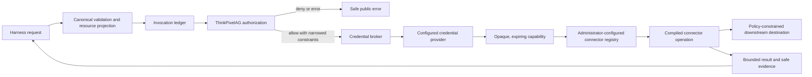

# Connector and credential architecture

Status: Phase 5 implemented architecture; reviewed 2026-09-03

ThinkPixelTG owns the trusted boundary between a governed tool invocation and a
downstream provider. Credential providers and connectors are replaceable
adapters behind the application ports in `internal/ports`; provider-specific
types do not enter the application or domain model.

## Execution path and authority

The application creates or recovers the logical invocation, records the current
authorization decision, and accepts only an explicit allow before calling the
credential broker. The broker selects a tenant-scoped credential binding from
trusted tool and connector metadata. Ordinary arguments cannot name a provider,
secret, scope, audience, authorization header, connector, or destination.

Connector resolution likewise combines the authenticated tenant with immutable
tool metadata and administrator-owned connector instances. The registry rejects
unknown compiled operations, disabled or mismatched instances, duplicate
selectors, and caller-selected hosts. A connector receives the governed
invocation ID, canonical arguments, trusted resource projection, narrowed
authorization decision, and an opaque credential capability through the
`ConnectorExecutor` port.

## Credential providers and lifetime

The `CredentialProvider` port returns a typed capability with bounded target and
lifetime metadata. Secret bytes are available only through a callback that uses
an ephemeral copy; release is idempotent and erases owned bytes where practical.
Formatting, error, text, and JSON representations are always redacted. The
application releases the capability after the connector attempt.

The bounded in-memory provider cache keys entries only with trusted binding,
tenant, run, governed subject, target metadata, and revocation state. It expires
entries before provider expiry, coalesces concurrent misses, and supports
binding, run, and provider-epoch eviction. It neither persists plaintext nor
refreshes outside a governed resolution call.

Implemented providers are:

- `development`, restricted to development mode and explicit environment or
  absolute file references; and
- `kubernetes_projected`, the release-candidate production profile selected by
  [ADR-0003](../adr/0003-kubernetes-projected-credential-provider.md). It reads
  only allowlisted projected-token paths and validates bounded issuer, audience,
  issue-time, expiry, and maximum-lifetime claims.

The production provider is a workload capability, not subject delegation, a
general file-secret facility, or authorization. Missing, expired, revoked,
mismatched, or unavailable capabilities fail closed without fallback to stale or
broader credentials.

## Connector execution and evidence

Shared downstream HTTP handling fixes schemes, hosts, ports, TLS behavior,
redirect policy, safe headers, address policy, deadlines, cancellation, response
limits, and telemetry before a connector can send traffic. Credentials are
attached only for the provider call and removed immediately afterward. Inbound
TG bearer tokens are never forwarded downstream.

The first real adapter implements `github.pull.get` and
`github.pull.comment`. Both validate the immutable GitHub instance and trusted
repository projection. The write uses GitHub's create-comment endpoint, which
does not provide a native idempotency key; it is therefore `non_retryable`, and
an outcome that may have been sent is `unknown` rather than blindly retried. See
the [write qualification](../connectors/github-pull-comment-qualification.md)
for the provider-specific proof and residual duplicate risk.

Connector results expose only bounded schema-validated output. Execution
evidence may contain allowlisted provider request/result identifiers, a resource
version, and a small connector-defined safe metadata object. Credentials,
authorization headers, arbitrary headers or URLs, full request/response bodies,
and captured provider payloads are excluded from results, persistence, evidence,
and telemetry.

## Trust boundaries and extension rules

- Authentication and ThinkPixelAG remain the sources of governed identity and
  authorization; providers and connectors cannot expand either.
- PostgreSQL owns binding and connector references and safe metadata, while the
  configured provider owns credential plaintext.
- Connector destinations and provider references are privileged configuration,
  not invocation input.
- New providers implement `CredentialProvider`; new connector operations
  implement `ConnectorExecutor` and register against an administrator-owned
  connector type. They must satisfy the normative credential and connector
  contracts and conformance tests before use.
- Deployment policy must prevent the harness from bypassing TG and reaching
  governed downstream systems directly.

Normative requirements remain in the
[credential-provider](../contracts/credential-provider.md),
[connector](../contracts/connector.md), and
[evidence](../contracts/evidence.md) contracts.
