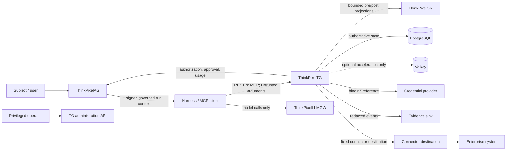

# System context and trust boundaries

Status: Phase 0 normative baseline

## Purpose

ThinkPixelTG (TG) is the policy-enforcement and credential-brokering boundary
between agent harnesses and governed enterprise systems. This document identifies
every participant, trust boundary, authoritative data flow, and prohibited bypass.

## Context

ThinkPixelLLMGW is adjacent to TG, not on the governed tool execution path. It
owns model routing and model credentials. TG must not accept an LLMGW decision as
tool authorization, and LLMGW must not provide downstream tool credentials.

## Participants and authority

| Participant | Trusted for | Never trusted for |
|---|---|---|
| Subject | expressing intent through AG | self-asserting tenant, run, agent, or approval authority |
| Harness / MCP client | transporting a requested tool name, arguments, and stable logical call ID | identity, authorization, risk metadata, connector choice, credential choice, or retry safety |
| ThinkPixelTG | enforcing the ordered control path and recording execution truth | inventing policy grants owned by AG or content-policy grants owned by GR |
| ThinkPixelAG | governed run context, authorization, constraints, approvals, revocation state, usage acceptance | connector execution, credential plaintext, or downstream completion truth |
| ThinkPixelGR | safety/data-policy evaluation of bounded projections | authorization, credential selection, or broadening an AG decision |
| ThinkPixelLLMGW | model access, routing, and model metering | governed tool authorization or tool credential brokerage |
| PostgreSQL | authoritative TG catalog, invocation, attempt, decision, evidence, usage, and outbox state | policy decisions not persisted from their authoritative issuer |
| Valkey | bounded cache/rate-limit acceleration where explicitly safe | authorization or correctness when PostgreSQL/AG says otherwise |
| Credential provider | resolving a trusted binding to a scoped capability | choosing a binding from caller input or granting policy authority |
| Connector | translating a validated operation to one configured destination | arbitrary egress, authorization, or changing trusted retry metadata |
| Evidence sink | durable external receipt of redacted events | execution control or authoritative TG state |
| Operator | narrowly authorized administration and manual review | ordinary invocation authority or unaudited direct database mutation |
| Enterprise system | its own resource authorization and provider-side result identifiers | TG run identity or safe replay classification without qualification |

## Trust boundaries

1. **Untrusted caller boundary.** All harness, MCP, prompt, file, and tool-result
   content is adversarial. Authentication proves the caller; ordinary fields do
   not establish governance identity.
2. **Policy boundary.** AG responses are accepted only from an authenticated,
   pinned endpoint and only after strict schema, correlation, freshness, and
   narrowing validation. GR responses are similarly authenticated and bounded,
   but cannot override AG.
3. **Credential boundary.** Credential plaintext may exist only inside the
   credential provider/connector execution path for the minimum lifetime. It may
   not enter requests to AG/GR, durable state, evidence, or caller responses.
4. **Persistence boundary.** PostgreSQL is authoritative. Valkey loss or poisoning
   may reduce availability but must not grant access or create a write.
5. **Egress boundary.** Connector instances map to administrator-controlled
   schemes, hosts, ports, TLS policy, and operations. Arguments cannot supply an
   arbitrary URL, redirect target, DNS policy, or secret reference.
6. **Administration boundary.** Administrative publication, binding changes,
   manual reconciliation, and emergency actions use separate authentication,
   authorization, endpoints, and append-only evidence from harness calls.
7. **Evidence boundary.** Outbound evidence is minimized and integrity protected;
   failure to publish cannot erase authoritative transactional records.

## Protected invocation flow

1. Authenticate caller and workload; derive tenant, subject, agent/version, run.
2. Resolve an enabled immutable tool version from tenant exposure state.
3. Validate and canonicalize arguments; compute digest and resource projection.
4. Acquire or replay the logical invocation in PostgreSQL.
5. Obtain and validate current AG authorization and narrowing constraints.
6. Run mandatory GR `pre_tool`; transformed security-relevant content returns to
   step 3 and requires fresh authorization and approval matching.
7. Obtain or verify action-scoped approval when policy requires it.
8. Recheck enabled state, authorization freshness, approval, and fencing.
9. Resolve the trusted credential binding, then execute only through its connector.
10. Classify completion or ambiguity; run GR `post_tool`; persist bounded result.
11. Transactionally append evidence and usage/outbox records before publication.

No credential resolution or connector send may occur before all mandatory
pre-execution controls pass. A GR allow cannot reverse an AG denial.

## Deployment bypass rule

Runtime network policy must allow a harness to reach TG and LLMGW but deny direct
access to governed enterprise destinations and credential providers. TG receives
only destination-specific egress. Application checks do not replace this rule.

## Failure posture

Protected operations fail closed on missing/invalid identity, tool metadata,
authorization, required approval, mandatory GR evaluation, credential binding,
or fencing. Unknown post-send completion is `ambiguous`, never a clean failure.
Optional Valkey and evidence-sink outages cannot create authority. Explicitly
qualified read-only paths may degrade only under a reviewed contract.
